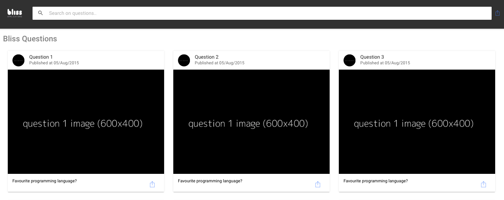
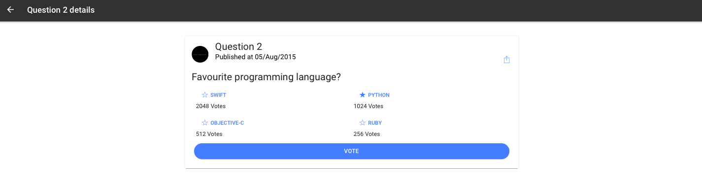

# questionsBliss

This progressive web app was made in [Ionic 3](https://github.com/ionic-team/ionic) with the purpose to show all bliss questions, view details for each one and vote.

[[Desktop Demo]](https://questionsbliss.firebaseapp.com/#/questions)
[[Android Demo]](questionsBliss.apk)

### Some implementation details
To build this app was used [Bliss Recruitment API](https://blissrecruitmentapi.docs.apiary.io/#reference).

### Installation & Development

1. clone this repo: `git clone https://github.com/renatogslopes/questionsBliss.git`
2. `cd questionsBliss`
3. `npm install`
4. run `ionic serve` from a terminal
5. The app will automatically reload if you change any of the source files.

## questionsBliss (Desktop version) - What you'll see. 

Main Page

Question Detail Page

## Author
Renato Lopes 

